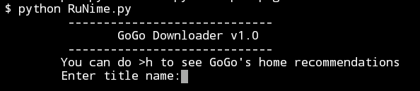
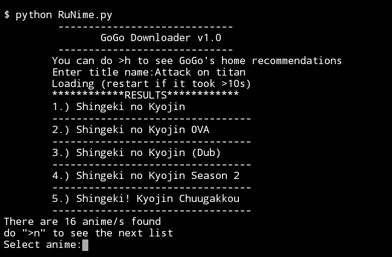

# GoGo-Downloader
A CLI reliant program that downloads, and searches anime from gogoanime.so 

**Requirments:**
```
1. Python v3.x.x 
2. pip
```

**Python modules used:**
```
-bs4(BeautifulSoup)

-requests
```
~~-html5lib(for bs4 html parser)~~
**No longer requred as of V1.15**

## Supported Platforms:
**•Termux: 100% tested**

**•Windows: Theoretically it will work**

**•Linux/unix: Theoretically it will work**

### How to install:

**Download my program on latest release**

***assuming user already has pip and python installed***

**Open terminal and do:**
```
$ apt-get update && apt-get upgrade
$ pip install bs4
$ pip install requests
$ pip install html5lib >"Not required v1.1 above"
$ pkg install aria2
```
**Basic Features:**
```
•You can Ctrl+C to pause a download during the process

•Bulk episode Download!

•Genre searching (V1.1 up)

•And many more for you to discover!
```

### Upcoming features:

~~•Genre based search (V1.1)~~ Complete

•Able to traverse through pages
 "e.g. gogoanime.so/?page=2" (V1.2)
 
•Preferred Quality selection (est. V1.3/V1.4)

## New way of accessing the program:
****!Only Works in Termux!****

-Download this [install.sh](https://minhaskamal.github.io/DownGit/#/home?url=https://github.com/Kinuseka/GoGo-Downloader/blob/main/install.sh)

-extract the .zip file

-On terminal go to the install.sh directory and do ```bash install.sh```

-After it is done u can now access the file by typing ```goanime``` and it will start running the program that was on ```/sdcard/GoGo-Downloader``` directory

### [old method]Before you start the python program:
-Make sure your directory is the same as the program's directory

-Make sure you have external storage permissions enabled

### [old method]To start:
```$ python RuNime.py```

**It should show up like this**



**A brief example of what you see should during usage**



